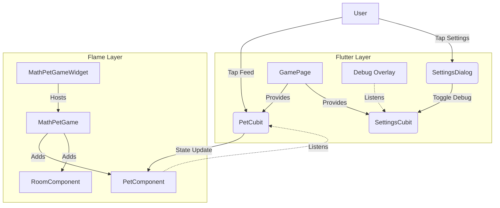

# Game Feature

## Purpose
This feature houses the core game loop powered by the **Flame Engine**. It is responsible for the "Tamagotchi" simulation visualization, including the pet, the room, and the interactive elements.

## Structure
- `game/`: Contains the `FlameGame` implementation (`MathPetGame`) and all game components (`components/`).
- `presentation/`: Contains the Flutter UI layer that hosts the game.
    - `widgets/`: The `MathPetGameWidget` which bridges Flame to Flutter.
    - `pages/`: The `GamePage` which acts as the main screen for this feature.

## Responsibilities
- **Flame (Game Layer)**: Handles rendering (60fps), animations, particle effects, and local gesture input (taps on sprites).
- **Flutter (Presentation Layer)**: Handles the hosting of the game, overlay UI (HUD), and injection of dependencies (Cubits).
- **Bridge**: The `MathPetGameWidget` connects the Flutter Bloc/Cubit state to the Flame Game via `FlameBlocListeners`.

## Architecture Diagram

