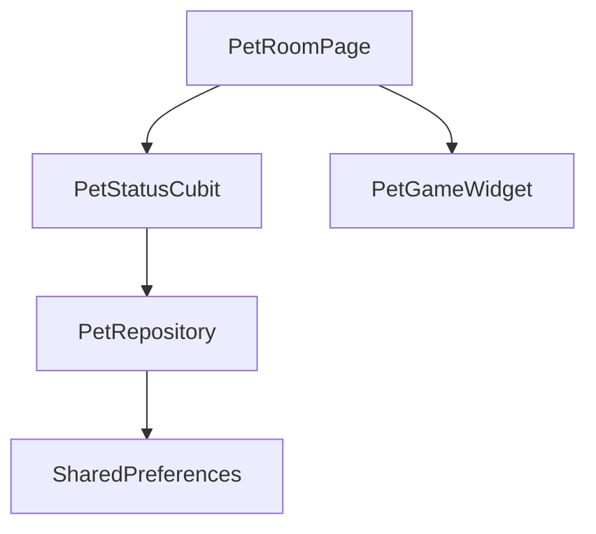

# Pet Room Feature

## Zweck
Dieses Feature beinhaltet das "Zuhause" des Haustiers. Hier wird das Tamagotchi gepflegt, gefüttert und interagiert.
Es ist der zentrale Screen, auf den der Nutzer immer wieder zurückkehrt.

## Architektur
Das Feature ist in drei Schichten unterteilt:
- **Presentation:** UI (Flame Game Widget, Status Bars) und State Management (Cubits).
- **Domain:** Business Logic (Hunger-Berechnung, Level-Up Regeln).
- **Data:** Persistenz des Pet-Status.

### Wichtige Klassen
*   `PetRoomPage`: Der Hauptscreen (Entry Point).
*   `PetGameWidget`: Das Flame-Widget, das das Pet rendert.
*   `PetStatusCubit`: Verwaltet Hunger, Happiness und XP.

## Abhängigkeiten
*   `core/theme`: Für Farben und Styles.
*   `core/utils`: Für Zeit-Berechnungen.

## Datenfluss

