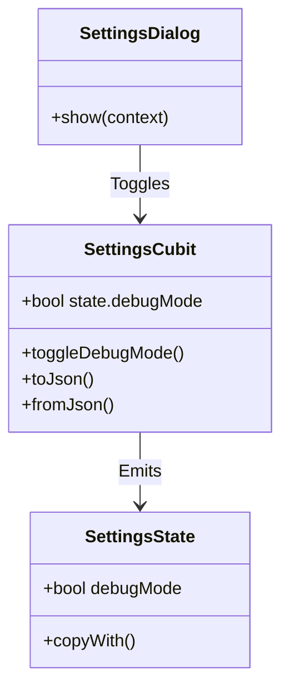

# Settings Feature

## Purpose
Manages global application settings such as Debug Mode, and in the future, Parent Settings. This feature is designed to be persistent and accessible from the Game Feature.

## Architecture

This feature uses `HydratedCubit` for persistence.

## Integration

The `SettingsCubit` is provided at the `GamePage` (or eventually App-level) so that visual layers can listen to `state.debugMode`.

### Null Safety & Testing
- Uses `HydratedBloc` v10+.
- Testers must mock `Storage`.
